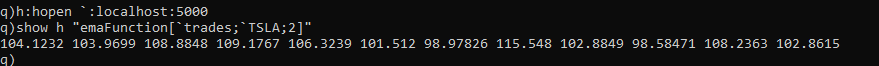

# Exercise: Trading data generation & analysis

Using kdb+ and q,

1. Populate a table similar to what stock data feeds provide.

2. Compute a moving average from data for a particular stock


## Populate a table similar to what stock data feeds provide

There are several ways you can do this:

- The example method is via this kdb+tick page: https://code.kx.com/q/wp/rt-tick/. Intended for building real time engines, it has a q script https://github.com/KxSystems/kdb-tick which sets up a socket listening on a port and spits out trade data every interval

- Alternatively, you can get a whole bunch of programming language integrations https://code.kx.com/q/interfaces/c-client-for-q/ under `Interfaces->Languages->..` on the left hand side. Then you'd need to glue data from endpoint api integrations like https://data.bloomberglp.com/professional/sites/10/2017/03/BLPAPI-Core-Developer-Guide.pdf or https://finazon.io/dataset/us_stocks_essential/docs/api/latest# to q table insertion statements.


Gluing APIs is out of the scope of this exercise, we'll make a script that generates trading data. See `server_script.q` and run it via 

`<q dir>>q server_script.q`

```
// setup table definitions
trades:([]time:`timestamp$();sym:`symbol$();price:`float$();size:`int$())

// data generation
tickers:`AAPL`GOOG`TSLA

n:30;
dt: n?1000;
t:.z.p + sums dt; / sums computes the cumulative sum (running total) of a list (in this case dt)

rows:([]
  time:t;
  sym:n?tickers;
  price:100 + 10 * n?1f;
  size:1 + n?100
  )
`trades insert rows
```

We generate a number of rows `n`, then insert it into the trades table

## Compute a moving average from data for a particular stock

We also define a function to compute the ema

```
// define function
emaFunction:{[table;ticker;n]
  show "running EMA";
  pricelist:exec price from table where sym=ticker;
  ma: ema[n;pricelist];
  ma} / returns ma
```

Then we open a new q client, connect , and use the returned connection 'h' to call the function:



`h:hopen `:localhost:5000`

`show h "emaFunction[`trades;`TSLA;2]"`

### Afterthoughts

- kdb+ and q are tough languages to learn; usability and error messages could be improved. If you try to use AI to fill in the gaps, it isn't quite there yet. A good question to ask is whether the setbacks are worth the increase in performance.

### References

Introd to kdb+ and q: https://www.youtube.com/watch?v=DAy2yKSt0fc